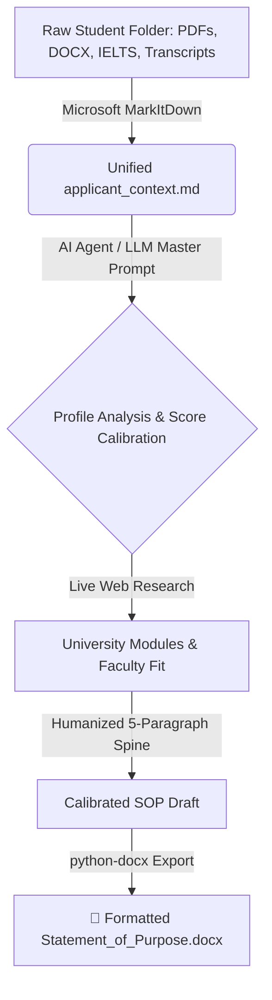

# 🎓 AI Statement of Purpose (SOP) Generator & Ingestion Engine

[](https://www.python.org/downloads/)
[](https://github.com/microsoft/markitdown)
[](LICENSE)
[](README.md)

An autonomous, tool-augmented AI pipeline designed to ingest multi-format applicant files (PDFs, DOCX, Transcripts, IELTS/TOEFL scores, Certificates, Audio), calibrate linguistic complexity to verified test scores, research target university curricula, and generate university-ready, humanized **Statements of Purpose (SOP)** with automated **Microsoft Word (`.docx`)** export.

---

## ⚡ One-Line Installation

Choose the one-line install command for your operating system:

### 🐧 Linux & 🍏 macOS

**Automated Installer (Recommended):**
```bash
curl -fsSL https://raw.githubusercontent.com/intelQong/markitdown-sop-generator/main/install.sh | bash
```

**Or Clone & Setup in One Line (Terminal / Bash / Zsh):**
```bash
git clone https://github.com/intelQong/markitdown-sop-generator.git && cd markitdown-sop-generator && python3 -m venv .venv && source .venv/bin/activate && pip install -r requirements.txt
```

---

### 🪟 Windows

**Automated Installer (PowerShell):**
```powershell
irm https://raw.githubusercontent.com/intelQong/markitdown-sop-generator/main/install.ps1 | iex
```

**Or Clone & Setup in One Line (PowerShell):**
```powershell
git clone https://github.com/intelQong/markitdown-sop-generator.git; cd markitdown-sop-generator; python -m venv .venv; .\.venv\Scripts\Activate.ps1; pip install -r requirements.txt
```

**Or Clone & Setup in One Line (Command Prompt / CMD):**
```cmd
git clone https://github.com/intelQong/markitdown-sop-generator.git && cd markitdown-sop-generator && python -m venv .venv && call .venv\Scripts\activate && pip install -r requirements.txt
```

---

### 📦 Install via Pip / Pipx (CLI Package)

You can also install the `sop-engine` CLI directly using `pip` or `pipx`:

```bash
pip install git+https://github.com/intelQong/markitdown-sop-generator.git
```
```bash
pipx install git+https://github.com/intelQong/markitdown-sop-generator.git
```

---

## 🌟 Key Features

* **Universal File Ingestion:** Powered by [Microsoft MarkItDown](https://github.com/microsoft/markitdown) to convert `.pdf`, `.docx`, `.pptx`, `.xlsx`, `.csv`, images, and audio into unified, clean Markdown.
* **Linguistic Score Calibration:** Automatically calibrates sentence structure and vocabulary to match the applicant's verified English proficiency (IELTS, TOEFL, PTE, Duolingo), eliminating AI-detection flags and ensuring credibility during visa/admissions interviews.
* **Jurisdiction-Specific Structuring:** Adheres to regional admission norms (e.g., UK Russell Group/UCAS 75-80% academic focus vs. US holistic narrative vs. Australia Genuine Student criteria).
* **Anti-AI Detection & Humanization:** Eliminates overused AI tropes (*delve, tapestry, testament, beacon, paramount*) and applies dynamic sentence burstiness.
* **Automated `.docx` Generation:** Formats the final statement with professional typography (1-inch margins, 1.15 line spacing, custom header styling).

---

## 🏗️ Architecture Workflow



---

## 🚀 Quick Start Guide

### 1. Ingest an Applicant's Folder to Markdown
Point the engine to a directory containing the applicant's transcripts, certificates, CV, and test scores:

```bash
# Using installed CLI command:
sop-engine --ingest "path/to/applicant_folder" --output-md "applicant_context.md"

# Or directly with Python:
python src/sop_engine.py --ingest "path/to/applicant_folder" --output-md "applicant_context.md"
```

### 2. Generate the SOP with an LLM Agent
1. Open the System Instructions in [`src/MASTER_PROMPT.md`](src/MASTER_PROMPT.md).
2. Copy the instructions into your AI Agent (e.g., Antigravity, Claude, ChatGPT, Gemini, LangChain, CrewAI).
3. Provide the generated `applicant_context.md` to produce the tailored, calibrated SOP text.

### 3. Export the SOP to Word (`.docx`)
Save your generated SOP text to a file (e.g., `final_sop.txt`) and export it with styled formatting:

```bash
# Using installed CLI command:
sop-engine --export-docx "final_sop.txt" --docx-out "SOP_John_Doe.docx" --name "John Doe" --course "MSc Data Science" --country "United Kingdom"

# Or directly with Python:
python src/sop_engine.py --export-docx "final_sop.txt" --docx-out "SOP_John_Doe.docx" --name "John Doe" --course "MSc Data Science" --country "United Kingdom"
```

---

## ⚙️ CLI Reference & Flags

| Flag | Short | Description | Default |
| :--- | :--- | :--- | :--- |
| `--ingest` | `-i` | Directory path containing applicant files to convert | None |
| `--output-md` | `-o` | Output Markdown filepath for extracted text | `applicant_context.md` |
| `--export-docx` | `-e` | Input text file containing final SOP to export | None |
| `--docx-out` | `-d` | Output `.docx` filepath | `Statement_of_Purpose.docx` |
| `--name` | | Applicant's full name (for document header) | `""` |
| `--course` | | Target degree or academic program | `""` |
| `--country` | | Destination country / jurisdiction | `""` |

---

## 📁 Repository Structure

```text
├── install.sh                  # One-line automated installer for Linux & macOS
├── install.ps1                 # One-line automated installer for Windows PowerShell
├── pyproject.toml              # Build configuration and CLI entry points
├── requirements.txt            # Python dependencies (root)
├── LICENSE                     # MIT License
├── README.md                   # Project documentation
└── src/
    ├── MASTER_PROMPT.md        # The complete System Instruction for LLM Agents
    ├── requirements.txt        # Python package dependencies
    └── sop_engine.py           # CLI tool for MarkItDown ingestion and DOCX export
```

---

## 🎯 Supported Ingestion Formats

| Category | Supported Extensions | Typical Handled Documents |
| :--- | :--- | :--- |
| **Documents** | `.pdf`, `.docx`, `.txt`, `.html` | Transcripts, recommendation letters, personal questionnaires, CVs |
| **Spreadsheets** | `.xlsx`, `.csv` | Mark sheets, grade conversion tables, financial records |
| **Presentations**| `.pptx` | Project presentations, competition slide decks |
| **Images / Scans** | `.jpg`, `.jpeg`, `.png` | Certificates, test score report cards, diplomas |
| **Audio** | `.mp3`, `.wav` | Interview recordings, voice memos, oral presentations |

---

## 📊 Linguistic Calibration Protocol

The master prompt strictly calibrates sentence length and vocabulary complexity to the applicant's verified English writing score:

| Calibration Tier | Score Criteria | Linguistic Style & Rules |
| :--- | :--- | :--- |
| **Tier 1** | IELTS Writing 5.0–5.5<br>Duolingo < 100<br>TOEFL Writing < 18 | Straightforward, grammatically sound standard English. **Strictly prohibits** hyper-elevated GRE/PhD vocabulary (*syllogism, paradigm, multifaceted, delve*). 100% defensible during visa credibility interviews. |
| **Tier 2** | IELTS Writing 6.0–6.5<br>Duolingo 105–120<br>TOEFL Writing 19–23 | Articulate, balanced compound sentences with natural academic terminology and moderate syntactic variation. |
| **Tier 3** | IELTS Writing 7.0+<br>Native Speaker | Advanced academic rhetoric, nuanced discourse, complex syntactic structures, and domain-specific terminology. |

---

## 📄 License

Distributed under the MIT License. See [`LICENSE`](LICENSE) for more information.
