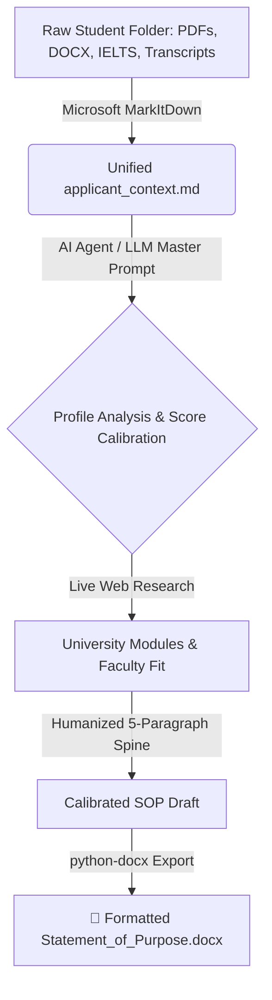

# 🎓 AI Statement of Purpose (SOP) Generator & Ingestion Engine

[](https://www.python.org/downloads/)
[](https://github.com/microsoft/markitdown)
[](https://opensource.org/licenses/MIT)

An autonomous, tool-augmented AI pipeline designed to ingest multi-format applicant files (PDFs, DOCX, Transcripts, IELTS/TOEFL scores, Certificates, Audio), calibrate linguistic complexity to verified test scores, research target university curricula, and generate university-ready, humanized **Statements of Purpose (SOP)** with automated **Microsoft Word (`.docx`)** export.

---

## 🌟 Key Features

* **Universal File Ingestion:** Powered by [Microsoft MarkItDown](https://github.com/microsoft/markitdown) to convert `.pdf`, `.docx`, `.pptx`, `.xlsx`, images, and audio into unified, clean Markdown.
* **Linguistic Score Calibration:** Automatically calibrates sentence structure and vocabulary to match the applicant's verified English proficiency (IELTS, TOEFL, PTE, Duolingo), eliminating AI-detection flags and ensuring credibility during visa/admissions interviews.
* **Jurisdiction-Specific Structuring:** Adheres to regional admission norms (e.g., UK Russell Group/UCAS 75-80% academic focus vs. US holistic narrative vs. Australia Genuine Student criteria).
* **Anti-AI Detection & Humanization:** Eliminates overused AI tropes (*delve, tapestry, testament, beacon*) and applies dynamic sentence burstiness.
* **Automated `.docx` Generation:** Formats the final statement with professional typography (1-inch margins, 1.15 line spacing, custom header styling).

---

## 🏗️ Architecture Workflow



---

## 🚀 Quick Start

### 1. Installation
Clone the repository and install required dependencies:
```bash
git clone https://github.com/your-username/markitdown-sop-generator.git
cd markitdown-sop-generator
pip install -r requirements.txt
```

### 2. Convert an Applicant's Folder to Markdown
```bash
python sop_engine.py --ingest "path/to/student_folder" --output-md "student_context.md"
```

### 3. Generate the SOP with an LLM
* Copy the contents of [`MASTER_PROMPT.md`](MASTER_PROMPT.md) into your AI Agent (e.g., Antigravity, Claude, ChatGPT, LangChain, CrewAI).
* Provide the generated `student_context.md` to produce the tailored, calibrated SOP.

### 4. Export the SOP to Word (.docx)
```bash
python sop_engine.py --export-docx "final_sop.txt" --docx-out "SOP_John_Doe.docx" --name "John Doe" --course "MSc Data Science" --country "United Kingdom"
```

---

## 📁 Repository Structure

```text
├── MASTER_PROMPT.md        # The complete System Instruction for LLM Agents
├── sop_engine.py           # CLI tool for MarkItDown ingestion and DOCX export
├── requirements.txt        # Python package dependencies
├── README.md               # Project documentation
```

---

## 🎯 Supported Ingestion Formats

| Format | Supported Extensions | Handled Data |
| :--- | :--- | :--- |
| **Documents** | `.docx`, `.pdf`, `.txt`, `.html` | Transcripts, recommendation letters, personal questionnaires |
| **Spreadsheets** | `.xlsx`, `.csv` | Mark sheets, grade conversions, financial records |
| **Presentations**| `.pptx` | Project presentations, competition slides |
| **Images/Scans** | `.jpg`, `.png` | Certificates, test score report cards |

---

## 📄 License
Distributed under the MIT License. See `LICENSE` for more information.